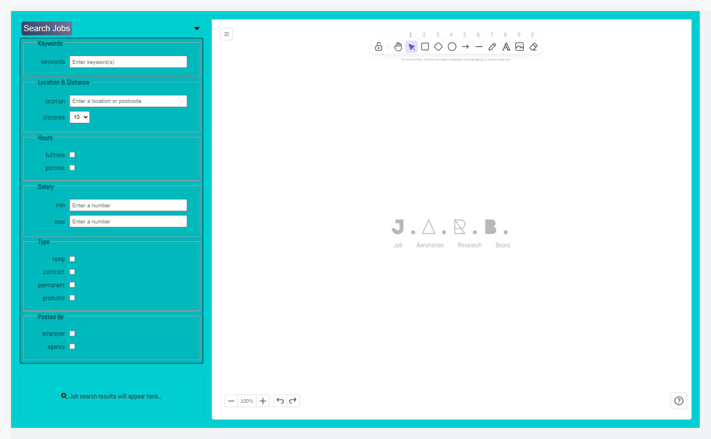

<a name="readme-top"></a>

<a href="#"></a>
<a href="#"></a>
# <a href="#"></a> Jarb | <a href="https://github.com/mattxmade/jarb/blob/main/README.md" target="_blank"> <strong>Live</strong></a>

> ### Job Annotation Research Board

<br>
<div align="center">
  <a href="#"></a>
  
  ###
  <a href="#"></a>
  <a href="#"></a>
  <a href="#"></a>
  <a href="#"></a>
  <a href="#"></a>
  <br>
  <a href="#"></a>
  <a href="#"></a>
</div>

## About

<strong><em>Job Annotation Research Board</em> (Jarb)</strong> is an interactive job board powered by <strong><a href="https://github.com/excalidraw/excalidraw">Excalidraw</a></strong> and <strong><a href="https://www.reed.co.uk/developers/Jobseeker">Reed Jobs API</a></strong>. 

Application backend is written in <strong>PHP</strong> and built using the <strong>Laravel</strong> framework which handles API calls, routing and Content Secuirty Policies (CSP). <strong>Vite</strong> is used to compile the application frontend, combining <strong>Blade</strong> templates and <strong>React</strong> written in <strong>TypeScript</strong>.

<strong>Inertia.js</strong> is used to bridge across these architectures.

## Features

<table>
  <thead>
  </thead>
  <tbody>
    <tr><td colspan=2></td></tr>
    <tr>
      <td align=center><strong>Job Search</strong></td>
      <td>Search and find jobs via robust search form</td>
    </tr>
    <tr><td colspan=2></td></tr>
    <tr>
      <td align=center><strong>Interactive Canvas</strong></td>
      <td>Make notes and draw shapes via Excalidraw powered canvas</td>
    </tr>
        <tr><td colspan=2></td></tr>
    <tr>
      <td align=center><strong>Text Highlighter</strong></td>
      <td>Quickly highlight text from job posts and autocopy to canvas</td>
    </tr>
  </tbody>
</table>

<br>

## Server
### API services

Form submissions are sent by **HTTP POST** request and handled server side via controller. 
Upon successful validation, a **HTTP GET** request to the Reed Jobs API is then made. A pagination attribute is added to the end of the request.

> **AppController Details** 📡
```php
public function search(SearchPostRequest $request): Response
{
  $validated = $request->validated();

  $query = $request["query"];
  $apiKey = config('services.reedjobs.key');

  $response = Http::withBasicAuth($apiKey, '')->get("https://www.reed.co.uk/api/1.0/search?$query&resultsToTake=5");

  return Inertia::render('Home', [
    'searchResponse' => $response->json(),
  ]);  
}
```

##

### Rules
Within the application, a successful search request is governed by validation rules. 

> **WordFilterRule extract**
```php
class WordsFilterRule implements ValidationRule
{
  public function validate(string $attribute, mixed $value, Closure $fail): void
  {
    $words = [];
    $words = array_merge($words, json_decode(file_get_contents(resource_path('json/words.json'))));

    $pass = true;

    foreach($words as $word) {
      if ( str_contains( strtolower($value), strtolower($word) ) ) { 
        $pass = false;
      }
    }

    if (!$pass) {
      $fail(':attribute search request failed');
    }
  }
}
```

<br>

> **Note** 📡
> 
> See <a href="https://github.com/mattxmade/jarb/blob/main/app/Rules/WordsFilterRule.php">**WordsFilterRule.php**</a> for full implementation.

##

### Content Security Policy
To mitigate the risk of Cross Site Scripting attacks, repsonse headers are sent with a CSP and configured using a nonce.

> **CSP Headers Details** 📡
```php

public function handle($request, Closure $next)
{
  return $next($request)->withHeaders([
    'Content-Security-Policy' => "script-src 'strict-dynamic' 'nonce-".Vite::cspNonce()."' http: https:; object-src 'none'; base-uri 'none';",
  ]);
}
```

<br>

## Client

### React UI Components
#### Excalidraw

**Jarb** integrates **Excalidraw** to handle canvas drawing. 

Excalidraw is a powerful React library that allows shapes, arrows and text to be drawn to a HTML5 Canvas. Under the hood Excalidraw uses <a href="https://github.com/rough-stuff/rough">**roughjs**</a>.

Within Jarb, text can be highlighted from any job post and copied directly to the Excalidraw canvas. This is achieved by storing highlighted text in state and programmatically passing this to Excalidraw, creating a new element.

> **Details** 📡
> 
> <a href="https://github.com/mattxmade/jarb/blob/main/resources/js/hooks/useExcalidraw.ts">**useExcalidraw.ts**</a>
>```ts
>const sessionElements = restoreElements(
>  excalidrawAPI.getSceneElements(),
>  null,
>  {
>    refreshDimensions: true,
>    repairBindings: true,
>  }
>);
>
>const sceneData = {
>  elements: [...sessionElements, textElement],
>  appState: excalidrawAPI.getAppState(),
>};
>
>excalidrawAPI.updateScene(sceneData as any);
>lastTextRef.current = id_textElement;
>```

<br>
<p align="right">(<a href="#readme-top">back to top</a>)</p>

## Roadmap

- [x] <strong>Build UI</strong>
  - [x] Create job search form
  - [x] Integrate Excalidraw React library

- [x] <strong>Build backend</strong>
  - [x] Handle routing
  - [x] Implement API services
  - [x] Add Content Security Policies

##

### Environment

<a href="#"></a>

### Build Tools

<a href="#"></a>

### Developer Tools

<a href="#"></a>
<a href="#"></a>
<a href="#"></a>

##

### Deployment

<a href="#"></a>

<p align="right">(<a href="#readme-top">back to top</a>)</p>
